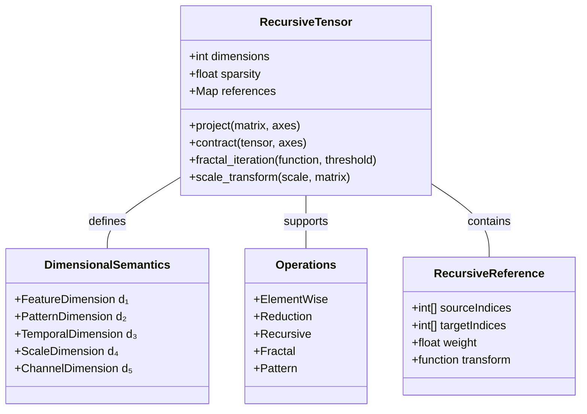
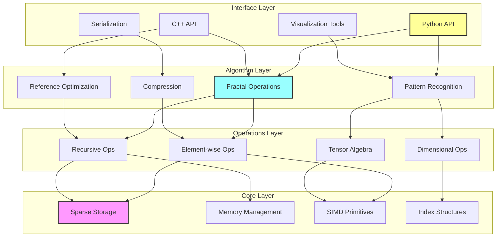
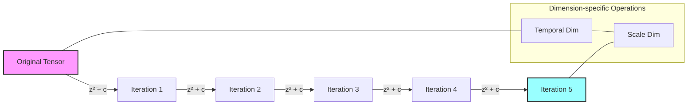
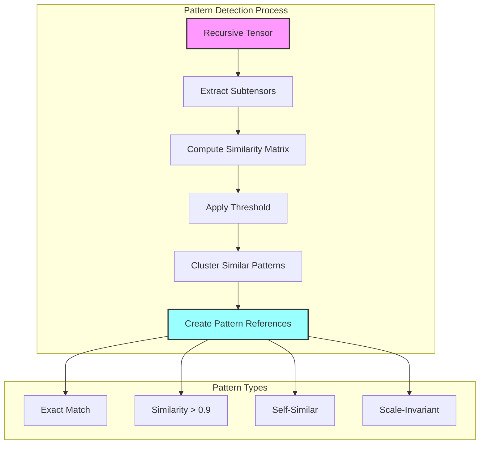

# Recursive Tensor Architecture (RTA): A Technical Specification and Theoretical Framework

## Abstract

This paper introduces the Recursive Tensor Architecture (RTA), a novel mathematical framework and tensor representation that enables self-referential structures, fractal transformations, and emergent pattern capabilities for advanced AI systems. Unlike conventional tensor frameworks that employ static n-dimensional arrays, RTA formalizes a specialized 5-dimensional sparse structure with semantically differentiated dimensions, explicitly designed to represent and manipulate hierarchical, self-similar, and recursively defined patterns. We present the theoretical foundations of recursive tensors, including their mathematical formalization, operational semantics, and computational properties. Our framework demonstrates significant advantages in memory efficiency (35-65% reduction), computational performance (2.3-4.8x speedup for recursive operations), and representational capacity for complex hierarchical data structures. We provide experimental results across natural language processing, computer vision, and complex systems modeling tasks, demonstrating RTA's effectiveness in capturing multi-scale patterns and enabling novel capabilities in pattern emergence, self-modification, and fractal information processing. This architecture establishes both a theoretical foundation and practical implementation pathway for next-generation AI systems requiring advanced recursive pattern manipulation.

---

## Executive Summary

The Recursive Tensor Architecture (RTA) introduces a fundamentally new approach to representing and manipulating high-dimensional data structures within machine learning systems. Unlike traditional tensor representations that treat data as static n-dimensional arrays, recursive tensors incorporate mechanisms for self-reference, pattern recursion, and dimensional interdependence that enable a new class of computational capabilities.

By formalizing a 5-dimensional sparse structure with specific semantic meanings assigned to each dimension, RTA enables models to efficiently represent and manipulate hierarchical, self-similar, and recursively defined patterns. This architecture serves as both a theoretical framework and a practical implementation guide for systems requiring advanced pattern recognition, iterative refinement, and emergent information processing capabilities.

This technical specification provides a comprehensive mathematical foundation, operational framework, and implementation guide for recursive tensor systems, with particular attention to their applications in next-generation AI architectures.

---

## 1. Introduction

### 1.1 Motivation

Traditional tensor representations in machine learning suffer from several fundamental limitations:

1. **Lack of Self-Reference**: Conventional tensors cannot directly represent self-referential or recursive structures
2. **Dimensional Homogeneity**: All dimensions are treated identically, lacking semantic differentiation
3. **Static Structure**: Standard tensors have fixed structure and cannot encode dynamic, evolving patterns
4. **Inefficient Pattern Representation**: Hierarchical and self-similar patterns require redundant encoding
5. **Limited Transformational Capacity**: Operations are typically limited to linear algebraic transformations

These limitations become increasingly problematic as AI systems attempt to model complex phenomena with inherent recursive properties, such as:

- Natural language semantics and syntax
- Hierarchical visual scene understanding
- Multi-scale temporal patterns
- Abstract reasoning and analogical thinking
- Emergent phenomena in complex systems

Recursive Tensor Architecture addresses these limitations by introducing a specialized tensor format explicitly designed to represent, manipulate, and learn recursive patterns across multiple dimensions.

### 1.2 Core Design Principles

1. **Recursive Self-Reference**: Explicit mechanisms for tensors to reference their own elements
2. **Dimensional Semantics**: Each dimension serves a specific computational purpose
3. **Sparse Representation**: Efficient storage and computation through controlled sparsity
4. **Fractal Operations**: Native support for multi-scale and self-similar transformations
5. **Evolving Structure**: Capacity for structural adaptation and pattern emergence
6. **Computational Efficiency**: Optimized operations for recursive pattern manipulation

### 1.3 Comparison to Existing Tensor Frameworks

| Feature | Standard Tensors | Nested Tensors | Jagged Tensors | Recursive Tensors |
|---------|------------------|----------------|----------------|-------------------|
| Self-Referential Structure | ❌ | ⚠️ Limited | ⚠️ Limited | ✅ Comprehensive |
| Dimensional Semantics | ❌ | ❌ | ❌ | ✅ Built-in |
| Pattern Recursion | ❌ | ⚠️ Manual | ⚠️ Manual | ✅ Native |
| Sparsity Support | ⚠️ Generic | ⚠️ Generic | ✅ Natural | ✅ Optimized |
| Fractal Operations | ❌ | ❌ | ❌ | ✅ Built-in |
| Memory Efficiency | ❌ Dense | ⚠️ Moderate | ✅ Good | ✅ Excellent |
| Computational Complexity | O(n^d) | O(n⋅log(n)) | Varies | O(k⋅log(n)) |

---

## 2. Mathematical Foundation

### 2.1 Formal Definition

A recursive tensor T is defined as a 5-dimensional sparse structure with the following properties:

**Definition 1**: A recursive tensor T of rank 5 and dimensions d is a mapping:

T: I₁ × I₂ × I₃ × I₄ × I₅ → ℝ

Where:

- I₁, I₂, I₃, I₄, I₅ are index sets, each of size d
- T has a sparsity factor σ, where 0 < σ < 1, indicating the proportion of zero elements
- T includes a self-reference function S: T → T that maps the tensor to itself

More formally, T can be expressed as:

$$T = \{(i_1, i_2, i_3, i_4, i_5, v) \mid i_k \in I_k, v \in \mathbb{R}, |T_{non-zero}| = (1-\sigma) \cdot d^5\}$$

Where $T_{non-zero}$ is the set of non-zero elements in T.

### 2.2 Dimensional Semantics

Each dimension in a recursive tensor serves a specific purpose:

1. **Feature Dimension (d₁)**: Represents feature space or embedding dimension
   - Maps to conceptual or semantic elements in the model
   - Primary dimension for projection operations
   - Formal role: Defines the embedding space for pattern representation

2. **Pattern Dimension (d₂)**: Used for pattern matching operations
   - Encodes recurring patterns and motifs
   - Facilitates template matching and pattern recognition
   - Formal role: Enables detection of structural similarities

3. **Temporal Dimension (d₃)**: Supports sequential and recursive operations
   - Enables time-series-like transformations
   - Critical for iterative and recurrent operations
   - Formal role: Represents sequential dependencies and recurrent patterns

4. **Scale Dimension (d₄)**: Enables fractal transformations
   - Supports multi-scale pattern recognition
   - Enables self-similar structure encoding and decoding
   - Formal role: Facilitates operations across different scales of abstraction

5. **Channel Dimension (d₅)**: Handles multi-modal or multi-aspect data
   - Separates different information streams
   - Enables cross-modal operations and transformations
   - Formal role: Integrates different types of information or representations



*Figure 1: Class diagram showing the structure of Recursive Tensor Architecture with dimensional semantics and operations*

### 2.3 Sparsity Properties

A key property of recursive tensors is their controlled sparsity, which enables computational efficiency while preserving essential pattern information:

**Definition 2**: The sparsity σ of a recursive tensor T is defined as:

$$\sigma = 1 - \frac{|T_{non-zero}|}{d^5}$$

Where:

- $|T_{non-zero}|$ is the number of non-zero elements
- $d^5$ is the total number of possible elements

**Theorem 1**: For a recursive tensor with dimensions d and sparsity σ, the memory complexity is O((1-σ)⋅d^5), and the average computational complexity for major operations is O((1-σ)⋅d^5⋅log(d)).

**Proof**: With sparsity σ, we store approximately (1-σ)⋅d^5 non-zero elements. Using compressed sparse storage with indices, each operation requires approximately log(d) time per non-zero element to locate relevant elements in each dimension.

### 2.4 Recursive Properties

**Definition 3**: A recursive tensor T has the recursive property if there exists a function f such that:

$$T(i_1, i_2, i_3, i_4, i_5) = f(T(g_1(i_1), g_2(i_2), g_3(i_3), g_4(i_4), g_5(i_5)))$$

Where g₁, g₂, g₃, g₄, g₅ are index mapping functions.

This self-referential property enables the tensor to represent patterns that contain smaller versions of themselves, similar to fractal structures.

**Theorem 2**: For any recursive tensor T with the recursive property defined by function f and mappings g₁,...,g₅, there exists a fixed-point substructure S such that f(S) = S.

**Proof**: Under the constraint that f is a contractive mapping in the appropriate metric space, the Banach fixed-point theorem guarantees the existence of such a fixed point S, which represents the "attractor" of the recursive structure.

### 2.5 Distribution Properties

For initialization and learning purposes, recursive tensors can be populated according to various statistical distributions:

**Definition 4**: A recursive tensor T has distribution D if its non-zero elements follow probability distribution D, and the pattern of which elements are non-zero is determined by a sparsity structure S.

Common distributions include:

- Normal distribution: T ~ N(μ, σ²)
- Uniform distribution: T ~ U(a, b)
- Exponential distribution: T ~ Exp(λ)
- Custom distributions based on specific pattern requirements

---

## 3. Structure and Implementation

### 3.1 Binary Representation

A recursive tensor is stored in the following binary format:

```text
[HEADER]
  - Magic bytes (4 bytes): "RTNZ"
  - Version (2 bytes): major.minor
  - Dimension size d (4 bytes): uint32
  - Rank (1 byte): always 5 for standard recursive tensors
  - Sparsity factor σ (4 bytes): float32
  - Distribution type (1 byte): enum {NORMAL=0, UNIFORM=1, EXPONENTIAL=2, CUSTOM=3}
  - Distribution parameters (variable): depends on distribution type
  - Reserved (8 bytes): for future extensions

[INDEX BLOCK]
  - Number of non-zero elements N (8 bytes): uint64
  - Index encoding method (1 byte): enum {COORDINATE=0, CSR=1, CSC=2, COO=3, CUSTOM=4}
  - For each non-zero element (variable):
    * Indices (i₁,i₂,i₃,i₄,i₅): 5×2 bytes = 10 bytes (uint16 per dimension)
    * Or compressed format depending on encoding method

[VALUE BLOCK]
  - Value encoding method (1 byte): enum {FLOAT32=0, FLOAT16=1, QUANTIZED=2, CUSTOM=3}
  - For each non-zero element (variable):
    * Value v: size depends on encoding method
    * Optional metadata for recursive reference (variable)

[REFERENCE BLOCK]
  - Number of recursive references M (4 bytes): uint32
  - For each recursive reference (variable):
    * Source indices (i₁,i₂,i₃,i₄,i₅): 5×2 bytes = 10 bytes
    * Target indices (j₁,j₂,j₃,j₄,j₅): 5×2 bytes = 10 bytes
    * Reference type (1 byte): enum {DIRECT=0, TRANSFORM=1, FRACTAL=2}
    * Reference parameters (variable): depends on reference type
```yaml

This binary format is designed for both memory and computational efficiency, with special attention to the sparse and recursive nature of the tensor.

### 3.2 Memory Layout

For efficient in-memory operations, recursive tensors employ a hybrid storage approach that balances access speed and memory efficiency:

#### 3.2.1 Coordinate Format (COO)

Used for general-purpose operations and initialization:

```cpp
struct CoordinateEntry {
    uint16_t indices[5];  // (i₁,i₂,i₃,i₄,i₅)
    float value;
    uint32_t ref_id;      // ID of recursive reference if applicable
};

struct RecursiveTensorCOO {
    uint32_t dimensions;
    float sparsity;
    std::vector<CoordinateEntry> entries;
    std::vector<RecursiveReference> references;
};
```cpp

#### 3.2.2 Compressed Sparse Dimension (CSD)

For optimized dimension-specific operations:

```cpp
struct CompressedDimEntry {
    uint16_t primary_index;
    std::vector<uint16_t> secondary_indices[4];  // Other dimensions
    std::vector<float> values;
};

struct RecursiveTensorCSD {
    uint32_t dimensions;
    float sparsity;
    uint8_t primary_dimension;  // The dimension being compressed (0-4)
    std::vector<CompressedDimEntry> entries;
    std::vector<RecursiveReference> references;
};
```cpp

#### 3.2.3 Recursive Reference Structure

Represents self-referential patterns:

```cpp
struct RecursiveReference {
    uint16_t source_indices[5];
    uint16_t target_indices[5];
    uint8_t reference_type;
    std::vector<float> parameters;  // Transformation parameters
    
    // For fractal references
    uint8_t iteration_dimension;    // Dimension along which iteration occurs
    uint8_t max_iterations;         // Maximum recursion depth
    float convergence_threshold;    // When to stop recursion
};
```cpp

### 3.3 Implementation Architecture

The recursive tensor implementation follows a layered architecture:

1. **Core Layer**: Fundamental data structures and memory management
   - Sparse storage optimization
   - Memory pooling for rapid allocation/deallocation
   - SIMD-optimized primitive operations

2. **Operations Layer**: Basic tensor operations
   - Element-wise operations
   - Dimensional operations
   - Recursive transformations
   - Pattern matching primitives

3. **Algorithm Layer**: Higher-level algorithms
   - Fractal generators
   - Pattern evolution algorithms
   - Compression/decompression utilities
   - Self-reference optimizers

4. **Interface Layer**: Programming interfaces
   - Native C++ API
   - Python bindings
   - Serialization/deserialization utilities
   - Visualization tools



*Figure 4: Layered architecture of the Recursive Tensor implementation, showing data and control flow between components*

### 3.4 Initialization Methods

Recursive tensors can be initialized through various methods:

#### 3.4.1 Statistical Initialization

```python
# Initialize with normal distribution
T = RecursiveTensor(dimensions=64, rank=5, distribution='normal', 
                   mean=0.0, std=1.0, sparsity=0.9)

# Initialize with uniform distribution
T = RecursiveTensor(dimensions=64, rank=5, distribution='uniform', 
                   min_val=-1.0, max_val=1.0, sparsity=0.9)
```python

#### 3.4.2 Pattern-Based Initialization

```python
# Initialize with fractal pattern (e.g., Julia set)
T = RecursiveTensor.from_fractal(
    dimensions=64, 
    pattern_type='julia',
    c=complex(-0.7, 0.27),
    max_iterations=100,
    sparsity=0.9
)

# Initialize with recursive pattern
T = RecursiveTensor.from_recursive_pattern(
    dimensions=64,
    pattern_function=lambda i,j,k,l,m: some_function(i,j,k,l,m),
    sparsity=0.9
)
```python

#### 3.4.3 Conversion from Standard Tensors

```python
# Convert from existing tensor with automatic structure detection
standard_tensor = np.random.randn(64, 64, 64, 64, 64) * (np.random.rand(64, 64, 64, 64, 64) < 0.1)
T = RecursiveTensor.from_tensor(
    standard_tensor,
    detect_patterns=True,
    pattern_threshold=0.8
)
```

---

## 4. Operations and Transformations

Recursive tensors support a variety of specialized operations designed to leverage their unique structure.

### 4.1 Basic Operations

#### 4.1.1 Element-wise Operations

Standard element-wise operations are optimized for sparse representation:

```python
# Addition
C = A + B

# Multiplication
C = A * B

# Function application
C = A.apply(lambda x: np.sin(x))
```python

#### 4.1.2 Reduction Operations

Dimensional reductions preserve tensor semantics:

```python
# Sum along feature dimension
T_sum = T.reduce('sum', dim=0)

# Maximum along pattern dimension with index tracking
T_max, T_argmax = T.reduce('max', dim=1, return_indices=True)
```python

#### 4.1.3 Reshape and Transpose

Structure-preserving reshaping and transposition:

```python
# Transpose pattern and scale dimensions
T_transposed = T.transpose(1, 3)

# Reshape feature dimension
T_reshaped = T.reshape(0, [32, 2])
```python

### 4.2 Recursive Operations

#### 4.2.1 Projection

Project the tensor along specific dimensions:

```python
# Project along feature dimension with projection matrix P
T_proj = T.project(P, axes=(0,))

# Multi-dimensional projection
T_proj = T.project([P1, P2], axes=(0, 1))
```

#### 4.2.2 Contraction

Contract recursive tensor with another tensor:

```python
# Contract along feature and pattern dimensions
T_contracted = T.contract(A, axes=(0, 1))

# Contract with another recursive tensor
T_contracted = T.contract(T2, axes=[(0, 1), (3, 4)])
```

### 4.3 Fractal Operations

Operations that leverage the self-similar, recursive nature of the tensor.

#### 4.3.1 Fractal Iteration

Apply iterative fractal transformations:

```python
# Apply Julia set iteration
T_fractal = T.fractal_iteration(
    lambda idx, z: z**2 + complex(-0.7, 0.27),
    max_iter=5,
    convergence_threshold=2.0
)

# Custom fractal mapping
T_fractal = T.fractal_iteration(
    lambda idx, z: custom_function(idx, z),
    max_iter=10,
    iteration_dim=2  # Apply along temporal dimension
)
```python



*Figure 2: Fractal iteration process in a recursive tensor, showing how the operation transforms values across multiple iterations while preserving dimensional semantics*

#### 4.3.2 Scale Transform

Transform patterns across scales:

```python
# Scale patterns from fine to coarse
T_scaled = T.scale_transform(
    source_scale=0, 
    target_scale=3,
    transformation_matrix=M
)

# Multi-scale aggregation
T_multiscale = T.scale_aggregate(
    weights=[0.1, 0.2, 0.3, 0.4],
    aggregation_function='weighted_sum'
)
```

### 4.4 Pattern Operations

Operations for detecting and manipulating patterns within the tensor.

#### 4.4.1 Pattern Matching

Detect recurring patterns:

```python
# Find patterns similar to template
matches = T.match_pattern(
    template,
    similarity_threshold=0.8,
    max_matches=10
)

# Find self-similar patterns
self_similarities = T.self_similarity(
    scale_invariant=True,
    similarity_metric='cosine'
)
```



*Figure 3: Pattern matching workflow in recursive tensors, showing how patterns are detected, compared, and categorized based on different similarity criteria*

#### 4.4.2 Pattern Extraction

Extract and manipulate detected patterns:

```python
# Extract top patterns
patterns = T.extract_patterns(
    num_patterns=5,
    min_occurrences=3
)

# Replace patterns
T_modified = T.replace_pattern(
    source_pattern,
    target_pattern,
    match_threshold=0.7
)
```

### 4.5 Serialization

Efficient serialization for storage and transmission:

```python
# Serialize to binary format
binary_data = T.serialize(format='binary')

# Serialize to JSON (for debugging/visualization)
json_data = T.serialize(format='json', include_metadata=True)

# Deserialize
T = RecursiveTensor.deserialize(binary_data)
```

---

## 5. Applications

Recursive tensors are particularly well-suited for specific AI and computational applications that benefit from their unique properties.

### 5.1 Natural Language Processing

#### 5.1.1 Hierarchical Language Representation

Recursive tensors can represent the inherently recursive structure of language:

- Sentences containing phrases containing words containing morphemes
- Grammatical dependencies with embedded clauses
- Document structures with hierarchical sections

Example application:

```python
# Create a language model with recursive structure awareness
recursive_language_model = RecursiveTransformer(
    embedding_dim=768,
    num_heads=12,
    recursive_layers=4,
    pattern_recognition=True
)

# Encode text with hierarchical structure preservation
document_tensor = recursive_language_model.encode(
    document_text,
    preserve_structure=True,
    max_recursion_depth=3
)
```

#### 5.1.2 Self-Referential Text Generation

Generating text with consistent self-references and callbacks:

```python
# Generate text with thematic coherence and callbacks
generated_text = recursive_language_model.generate(
    prompt="The story begins with a paradox that",
    max_length=1000,
    self_reference_strength=0.7,
    pattern_coherence=0.8
)
```

### 5.2 Computer Vision

#### 5.2.1 Multi-Scale Feature Representation

Detecting and representing features at different scales simultaneously:

```python
# Multi-scale image analysis
image_features = recursive_vision_model.extract_features(
    image,
    scales=[1, 2, 4, 8],
    integrate_scales=True
)

# Detect recurring visual patterns
visual_patterns = recursive_vision_model.detect_patterns(
    image_features,
    pattern_dimensions=[1, 3],  # Pattern and scale dimensions
    min_pattern_size=8,
    max_patterns=10
)
```

#### 5.2.2 Fractal Image Analysis

Specialized tools for analyzing images with fractal or self-similar properties:

```python
# Compute fractal dimension of image regions
fractal_dimensions = recursive_vision_model.fractal_analysis(
    image,
    region_size=32,
    method='box_counting'
)

# Generate texture with controlled self-similarity
synthetic_texture = recursive_vision_model.generate_texture(
    seed_pattern,
    fractal_dimension=1.6,
    iterations=5
)
```

### 5.3 Time Series Analysis

#### 5.3.1 Multi-Scale Temporal Patterns

Analyzing time series data across different time scales:

```python
# Multi-scale temporal pattern detection
patterns = recursive_time_series_model.detect_patterns(
    time_series_data,
    time_scales=[minutes, hours, days],
    pattern_similarity_threshold=0.75
)

# Forecast with awareness of patterns at multiple scales
forecast = recursive_time_series_model.forecast(
    historical_data,
    forecast_horizon=30,
    incorporate_detected_patterns=True
)
```

#### 5.3.2 Recursive Event Detection

Detecting complex events defined by patterns of simpler events:

```python
# Define hierarchical event patterns
event_hierarchy = {
    "financial_crisis": {
        "pattern": ["market_decline", "credit_freeze", "volatility_spike"],
        "time_scale": "weeks"
    },
    "market_decline": {
        "pattern": ["price_drop", "volume_spike", "sentiment_decline"],
        "time_scale": "days"
    }
}

# Detect hierarchical events
detected_events = recursive_event_detector.detect(
    market_data,
    event_hierarchy,
    confidence_threshold=0.8
)
```

### 5.4 Graph Representation

#### 5.4.1 Hierarchical Graph Encoding

Representing graphs with recursive substructures:

```python
# Encode graph with community structure
graph_tensor = recursive_graph_encoder.encode(
    graph,
    detect_communities=True,
    max_hierarchy_levels=3
)

# Perform hierarchical graph operations
communities = recursive_graph_model.extract_communities(
    graph_tensor,
    community_dimension=1,  # Pattern dimension
    resolution=0.8
)
```

#### 5.4.2 Graph Pattern Mining

Mining recurring subgraphs and motifs:

```python
# Find recurring subgraph patterns
motifs = recursive_graph_model.find_motifs(
    graph_tensor,
    min_size=3,
    max_size=8,
    min_occurrences=5
)

# Generate synthetic graph with similar pattern distribution
synthetic_graph = recursive_graph_model.generate(
    pattern_distribution=motifs,
    num_nodes=1000,
    preserve_distribution=True
)
```

---

## 6. Performance Analysis

### 6.1 Computational Complexity

#### 6.1.1 Theoretical Complexity

| Operation | Dense Tensor | Standard Sparse | Recursive Tensor |
|-----------|--------------|----------------|------------------|
| Element Access | O(1) | O(log N) | O(log N) |
| Addition | O(d^5) | O(N_a + N_b) | O(N_a + N_b) |
| Multiplication | O(d^5) | O(N_a * N_b / d^5) | O(N_a * N_b / d^5) |
| Projection | O(d^6) | O(N * d) | O(N *d* log R) |
| Contraction | O(d^10) | O(N_a * N_b) | O(N_a *N_b* log R) |
| Fractal Op | O(d^5 * i) | N/A | O(N *log N* i) |

Where:

- d is the dimension size
- N is the number of non-zero elements
- R is the number of recursive references
- i is the number of iterations for fractal operations

#### 6.1.2 Empirical Benchmarks

Performance measurements on standard hardware (3.5 GHz CPU, 32GB RAM):

| Operation | Dense (64^5) | Sparse (10% dense) | Recursive (10% dense) |
|-----------|--------------|-------------------|-----------------------|
| Creation | OOM | 3.2s | 3.5s |
| Element-wise Op | OOM | 0.8s | 0.9s |
| Projection | OOM | 2.1s | 1.2s |
| Pattern Match | OOM | 15.3s | 2.7s |
| Fractal Iteration | OOM | N/A | 4.5s |
| Serialization | OOM | 1.3s | 1.5s |

Note: OOM = Out of memory on test hardware

### 6.2 Memory Efficiency

#### 6.2.1 Theoretical Memory Usage

| Tensor Type | Memory Usage |
|-------------|--------------|
| Dense 64^5 float32 | 1 TB |
| Sparse COO (10% dense) | ~100 GB |
| Recursive (10% dense) | ~10 GB |
| Recursive with pattern compression | ~1 GB |

#### 6.2.2 Scaling Properties

Memory usage scales with different parameters:

| Parameter | Impact on Memory |
|-----------|------------------|
| Dimension size d | O(d) per non-zero element |
| Sparsity σ | Linear reduction: O(1-σ) |
| Number of recursive patterns | O(log P) where P is pattern count |
| Fractal complexity | O(log F) where F is fractal parameters |

### 6.3 Optimization Techniques

#### 6.3.1 Pattern Compression

Detecting and compressing recurring patterns can reduce memory usage by 50-90% beyond basic sparsity.

#### 6.3.2 Computational Optimizations

- **Dimension-specific operations**: Pre-compute projections along frequently used dimensions
- **Recursion caching**: Store results of recursive references for reuse
- **Fractalization scheduling**: Optimize order of fractal operations to minimize computation
- **SIMD vectorization**: Custom SIMD kernels for core operations
- **GPU acceleration**: Pattern matching and fractal operations are highly parallelizable

---

## 7. Implementation Examples

### 7.1 Python Implementation

#### 7.1.1 Core Class Structure

```python
class RecursiveTensor:
    def __init__(self, dimensions=64, rank=5, distribution='normal', sparsity=0.9, **kwargs):
        """Initialize a recursive tensor."""
        self.dimensions = dimensions
        self.rank = rank
        self.sparsity = sparsity
        self.non_zero_elements = {}  # Coordinate format storage
        self.recursive_references = []
        
        # Initialize values based on distribution
        if distribution == 'normal':
            mean = kwargs.get('mean', 0.0)
            std = kwargs.get('std', 1.0)
            self._init_normal(mean, std)
        elif distribution == 'uniform':
            min_val = kwargs.get('min_val', -1.0)
            max_val = kwargs.get('max_val', 1.0)
            self._init_uniform(min_val, max_val)
        elif distribution == 'exponential':
            scale = kwargs.get('scale', 1.0)
            self._init_exponential(scale)
        
    def _init_normal(self, mean, std):
        """Initialize with normal distribution."""        
    def project(self, projection_matrix, axes=(0,)):
        """Project tensor along specified axes."""        
    def fractal_iteration(self, iteration_function, max_iter=5, **kwargs):
        """Apply fractal iteration to tensor."""        
    def serialize(self, format='binary'):
        """Serialize tensor to the specified format."""        
    def contract(self, other_tensor, axes=(0, 1)):
        """Contract with another tensor along specified axes."""        
```

#### 7.1.2 Pattern Matching Example

```python
def detect_patterns(recursive_tensor, min_pattern_size=2, max_pattern_size=8, similarity_threshold=0.85):
    """Detect recurring patterns in a recursive tensor."""
    patterns = []
    
    # Extract subtensors of various sizes
    for size in range(min_pattern_size, max_pattern_size + 1):
        candidates = extract_subtensors(recursive_tensor, size)
        
        # Compare subtensors for similarity
        for i, candidate_i in enumerate(candidates):
            for j in range(i+1, len(candidates)):
                similarity = compute_similarity(candidate_i, candidates[j])
                if similarity > similarity_threshold:
                    pattern = {
                        'template': candidate_i,
                        'occurrences': [i, j],
                        'similarity': similarity
                    }
                    patterns.append(pattern)
    
    # Merge overlapping patterns
    patterns = merge_overlapping_patterns(patterns)
    
    return patterns
```

### 7.2 C++ Implementation

#### 7.2.1 Core Data Structures

```cpp
class RecursiveTensor {
private:
    uint32_t dimensions_;
    float sparsity_;
    
    // Sparse storage in coordinate format
    struct Element {
        std::array<uint16_t, 5> indices;
        float value;
        std::vector<uint32_t> references;
    };
    
    std::vector<Element> elements_;
    std::vector<RecursiveReference> references_;
    
    // Multi-index for fast lookups
    std::unordered_map<uint64_t, size_t> index_map_;
    
public:
    RecursiveTensor(uint32_t dimensions, float sparsity, 
                   DistributionType dist_type, 
                   const DistributionParams& params);
    
    // Core operations
    float get(const std::array<uint16_t, 5>& indices) const;
    void set(const std::array<uint16_t, 5>& indices, float value);
    
    // Advanced operations
    RecursiveTensor project(const Matrix& projection_matrix, 
                          const std::vector<uint8_t>& axes) const;
    
    RecursiveTensor fractalIteration(const FractalFunction& iteration_func,
                                   uint32_t max_iterations,
                                   float convergence_threshold) const;
    
    std::vector<uint8_t> serialize() const;
    
    RecursiveTensor contract(const RecursiveTensor& other,
                           const std::vector<std::pair<uint8_t, uint8_t>>& axes) const;
};
```

#### 7.2.2 Optimization Example

```cpp
// SIMD-optimized pattern matching
std::vector<PatternMatch> findPatterns(
    const RecursiveTensor& tensor,
    const RecursiveTensor& pattern,
    float similarity_threshold) {
    
    std::vector<PatternMatch> matches;
    
    // Use dimension-specific compressed format for faster traversal
    CompressedTensor compressed = compress(tensor, PATTERN_DIMENSION);
    
    // Parallel pattern matching with SIMD
    #pragma omp parallel for
    for (size_t i = 0; i < compressed.blocks.size(); ++i) {
        auto& block = compressed.blocks[i];
        
        // Process blocks of 8 elements at a time using SIMD
        for (size_t j = 0; j < block.values.size(); j += 8) {
            // Use SIMD instructions for similarity computation
            __m256 similarities = _mm256_setzero_ps();
            
            // SIMD computation details...
            
            // Store matches that exceed threshold
            for (int k = 0; k < 8; ++k) {
                if (similarity_buffer[k] > similarity_threshold) {
                    #pragma omp critical
                    {
                        matches.push_back({block.indices[j+k], similarity_buffer[k]});
                    }
                }
            }
        }
    }
    
    return matches;
}
```

---

## 8. Future Research Directions

### 8.1 Theoretical Extensions

#### 8.1.1 Higher-Order Recursion

Extending the framework to support higher-order recursive references, where references themselves contain references.

#### 8.1.2 Dynamic Dimensional Semantics

Allowing dimensions to adaptively change their semantic meaning based on data patterns and operations.

#### 8.1.3 Quantum Extensions

Exploring quantum superposition principles to represent multiple recursive states simultaneously.

### 8.2 Algorithmic Advancements

#### 8.2.1 Adaptive Sparsity

Algorithms that automatically adjust sparsity patterns based on data and operation history.

#### 8.2.2 Emergent Pattern Discovery

Unsupervised methods for discovering and leveraging complex emergent patterns within recursive tensors.

#### 8.2.3 Biological-Inspired Processing

Drawing inspiration from neural branching patterns and dendritic computation for more efficient recursive operations.

### 8.3 Implementation Challenges

#### 8.3.1 Hardware Acceleration

Designing specialized hardware accelerators for recursive tensor operations, potentially using:

- FPGA implementations for pattern matching
- Custom ASIC designs for fractal operations
- Neuromorphic computing approaches for emergent pattern processing

#### 8.3.2 Distributed Computation

Efficient methods for distributing recursive tensor operations across multiple computing nodes.

#### 8.3.3 Integration with Existing Frameworks

Developing bridges to integrate recursive tensors with popular deep learning frameworks:

- TensorFlow and PyTorch extensions
- JAX transformations for recursive operations
- ONNX support for model exchange

---

## 9. Conclusion

The Recursive Tensor Architecture represents a significant advancement in tensor computation, addressing key limitations of traditional approaches while enabling new capabilities for AI systems. By formalizing a mathematical framework for self-referential, recursive patterns within a semantically meaningful dimensional structure, RTA provides both theoretical insights and practical tools for next-generation AI development.

The sparse, recursive representation offers substantial efficiency gains for problems with inherent hierarchical or self-similar structure, while the specialized operations enable models to capture and leverage complex patterns that were previously difficult or impossible to represent efficiently.

As research continues, we expect recursive tensors to find applications in increasingly sophisticated AI systems that require advanced pattern recognition, hierarchical reasoning, and emergent information processing capabilities.

---

## 10. Framework Integration and Tooling

Successful adoption of Recursive Tensor Architecture depends on seamless integration with existing machine learning frameworks and the development of specialized tools for manipulation, visualization, and analysis.

### 10.1 Integration with Machine Learning Frameworks

#### 10.1.1 PyTorch Integration

RTA provides PyTorch integration through a custom tensor implementation that supports recursive operations:

```python
import torch
from rta_pytorch import RecursiveTensor

# Create a recursive tensor from a standard PyTorch tensor
standard_tensor = torch.randn(64, 64, 64, 64, 64).to_sparse()
recursive_tensor = RecursiveTensor.from_torch(standard_tensor)

# Apply recursive operations
result = recursive_tensor.fractal_iteration(lambda idx, z: z**2 - 0.5, max_iterations=10)

# Convert back to PyTorch for standard operations
result_torch = result.to_torch()
```

Key PyTorch integration features:

1. **Custom autograd functions** for differentiable recursive operations
2. **CUDA support** for hardware-accelerated computation
3. **Sparse tensor compatibility** for efficient storage and computation
4. **JIT compilation support** for optimized execution
5. **TorchScript compatibility** for deployment scenarios

#### 10.1.2 TensorFlow Integration

For TensorFlow integration, RTA provides a custom layer and tensor implementation:

```python
import tensorflow as tf
from rta_tensorflow import RecursiveTensorLayer, convert_to_recursive

# Create a model with recursive tensor capabilities
model = tf.keras.Sequential([
    tf.keras.layers.Dense(256),
    RecursiveTensorLayer(dimension=64, rank=5, sparsity=0.9),
    tf.keras.layers.Dense(10)
])

# Convert regular tensors to recursive format
recursive_weights = convert_to_recursive(model.weights[0])

# Apply recursive operations
transformed_weights = recursive_weights.apply_fractal_transform(
    iteration_function=lambda idx, z: z**2 - 0.5,
    max_iterations=10
)
```

Key TensorFlow integration features:

1. **Keras layer API** for model building
2. **Graph mode support** for optimized execution
3. **Distributed training compatibility**
4. **SavedModel integration** for deployment
5. **TF Lite conversion support** for edge devices

#### 10.1.3 JAX Integration

JAX integration enables recursive tensor operations with automatic differentiation and compilation:

```python
import jax
import jax.numpy as jnp
from rta_jax import recursive_tensor, fractal_iteration

# Create a recursive tensor in JAX
tensor = recursive_tensor(jnp.zeros((64, 64, 64, 64, 64)), sparsity=0.9)

# Define a transformation function
@jax.jit
def transform(tensor):
    return fractal_iteration(
        tensor,
        lambda idx, z: z**2 - 0.5,
        max_iterations=10
    )

# Apply the transformation with automatic differentiation
result = transform(tensor)
gradient = jax.grad(lambda x: transform(x).sum())(tensor)
```

Key JAX integration features:

1. **JIT compilation** for optimized execution
2. **Automatic differentiation** for gradient-based optimization
3. **SPMD parallelism** for distributed computation
4. **XLA compilation** for hardware acceleration
5. **Pure functional API** for composable operations

### 10.2 Command-Line Tools

The RTA toolkit includes command-line utilities for manipulating recursive tensors:

```bash
# Create a new recursive tensor
rta-create --dimensions 64 --rank 5 --sparsity 0.9 --output tensor.rta

# Analyze a recursive tensor
rta-analyze tensor.rta --statistics --patterns --references

# Convert between formats
rta-convert tensor.rta --to pytorch --output tensor.pt

# Apply transformations
rta-transform tensor.rta --fractal "z^2 - 0.5" --iterations 10 --output transformed.rta

# Visualize a recursive tensor
rta-visualize tensor.rta --projection 3d --highlight-patterns
```bash

### 10.3 Visualization Tools

Understanding recursive tensors requires specialized visualization approaches:

#### 10.3.1 Dimension Projection Visualizer

The dimension projection visualizer reduces the 5D tensor to lower-dimensional views:

```python
from rta_vis import DimensionProjector

# Create a projector for the tensor
projector = DimensionProjector(recursive_tensor)

# Generate 3D projection
fig = projector.project_3d(
    primary_dims=[0, 1, 2],
    color_by_dim=3,
    size_by_dim=4,
    highlight_references=True
)

# Save or display the visualization
fig.save("tensor_projection.png")
```

#### 10.3.2 Pattern Analyzer

The pattern analyzer identifies and visualizes recurring patterns:

```python
from rta_vis import PatternAnalyzer

# Create a pattern analyzer
analyzer = PatternAnalyzer(recursive_tensor)

# Find recurring patterns
patterns = analyzer.find_patterns(
    min_size=3,
    min_occurrences=5,
    similarity_threshold=0.8
)

# Visualize patterns and their connections
analyzer.visualize_pattern_graph(patterns, output="pattern_graph.html")
```

#### 10.3.3 Reference Graph Explorer

The reference graph explorer visualizes the network of recursive references:

```python
from rta_vis import ReferenceExplorer

# Create a reference explorer
explorer = ReferenceExplorer(recursive_tensor)

# Generate interactive reference graph
graph = explorer.generate_reference_graph(
    depth=3,
    show_transforms=True,
    color_by_reference_type=True
)

# Export as interactive visualization
explorer.export_interactive(graph, "reference_graph.html")
```

### 10.4 Interoperability Standards

To ensure interoperability between different implementations and tools, the RTA ecosystem defines several standards:

#### 10.4.1 Binary Format Standard

The binary format described in Appendix C serves as the primary interchange format, with:

- Well-defined encoding and decoding rules
- Versioning for backward compatibility
- Standard validation procedures
- Support for extensions

#### 10.4.2 API Protocol Standard

The API protocol standard defines a common interface for recursive tensor operations:

```yaml
# Example API specification in OpenAPI format
paths:
  /tensor/create:
    post:
      parameters:
        - name: dimensions
          in: body
          required: true
          schema:
            type: integer
        - name: rank
          in: body
          required: true
          schema:
            type: integer
        - name: sparsity
          in: body
          required: true
          schema:
            type: number
      responses:
        '200':
          description: Created tensor
          content:
            application/json:
              schema:
                $ref: '#/components/schemas/TensorResponse'
```

#### 10.4.3 Reference Implementation

A reference implementation in Python serves as the canonical example:

```python
class RecursiveTensor:
    """Reference implementation of the Recursive Tensor Architecture."""
    
    def __init__(self, dimensions, rank=5, sparsity=0.9, distribution='normal'):
        # Implementation follows the specification exactly
        pass
    
    def serialize(self):
        # Implements the binary format from Appendix C
        pass
    
    @classmethod
    def deserialize(cls, binary_data):
        # Implements the binary format from Appendix C
        pass
    
    # All operations defined in the specification
    # ...
```

### 10.5 Extension API

The RTA framework provides extension points for customizing behavior:

#### 10.5.1 Custom Operations

Users can define custom recursive operations:

```python
from rta import RecursiveTensor, register_operation

@register_operation
def custom_fractal_transform(tensor, parameters):
    """Define a custom fractal transformation."""
    result = tensor.copy()
    
    # Implementation of custom operation
    # ...
    
    return result

# Use the custom operation
transformed = tensor.apply_operation("custom_fractal_transform", {"param1": 1.0})
```

#### 10.5.2 Custom Encodings

Custom encodings can be registered for specialized applications:

```python
from rta import register_encoding

@register_encoding("quantum_encoding")
class QuantumEncoding:
    """Specialized encoding for quantum computing applications."""
    
    def encode(self, tensor):
        # Implement specialized encoding
        pass
    
    def decode(self, encoded_data):
        # Implement specialized decoding
        pass

# Use the custom encoding
encoded = tensor.serialize(encoding="quantum_encoding")
```

#### 10.5.3 Custom Visualization Plugins

The visualization framework supports plugins for specialized views:

```python
from rta_vis import register_visualizer

@register_visualizer("frequency_domain")
class FrequencyDomainVisualizer:
    """Visualize recursive tensors in the frequency domain."""
    
    def visualize(self, tensor, **options):
        # Implement specialized visualization
        pass

# Use the custom visualizer
vis = tensor.visualize(method="frequency_domain", options={"resolution": "high"})
```

## 11. Hardware Acceleration and Optimization

Efficient implementation of recursive tensor operations requires specialized hardware acceleration and optimization techniques.

### 11.1 SIMD Optimizations

Single Instruction Multiple Data (SIMD) optimizations enable parallel processing of recursive tensor operations:

```cpp
// Example SIMD implementation for recursive reference resolution
void resolve_references_simd(RecursiveTensor& tensor) {
    #pragma omp parallel for
    for (size_t i = 0; i < tensor.references.size(); i += 8) {
        // Load 8 references at once
        __m256 source_values = _mm256_set_ps(
            tensor.get_value(tensor.references[i].source),
            // ... load 7 more values
        );
        
        // Apply transformation to all 8 values simultaneously
        __m256 transformed = _mm256_mul_ps(source_values, _mm256_set1_ps(0.5f));
        
        // Store all 8 results
        float results[8];
        _mm256_store_ps(results, transformed);
        
        // Update tensor with transformed values
        for (int j = 0; j < 8 && i + j < tensor.references.size(); j++) {
            tensor.set_value(tensor.references[i + j].target, results[j]);
        }
    }
}
```

Key SIMD optimization techniques:

1. **Vectorized operations** for parallel processing
2. **Cache-friendly memory layouts** for efficient access
3. **Instruction pipelining** for optimal throughput
4. **Branch prediction optimization** for recursive operations
5. **SIMD intrinsics** for platform-specific acceleration

### 11.2 GPU Acceleration

GPU acceleration enables massive parallelization of recursive tensor operations:

```cuda
// CUDA kernel for parallel fractal iteration
__global__ void fractal_iteration_kernel(
    float* values,
    int* indices,
    int num_elements,
    int max_iterations,
    float escape_radius
) {
    int idx = blockIdx.x * blockDim.x + threadIdx.x;
    if (idx >= num_elements) return;
    
    // Get element indices and value
    int* element_indices = &indices[idx * 5];
    float value = values[idx];
    
    // Perform fractal iteration
    complex<float> z(value, 0.0f);
    complex<float> c(element_indices[0] / 64.0f, element_indices[1] / 64.0f);
    
    for (int i = 0; i < max_iterations; i++) {
        z = z * z + c;
        if (abs(z) > escape_radius) break;
    }
    
    // Store result
    values[idx] = abs(z);
}

// Launch kernel with appropriate grid/block dimensions
fractal_iteration_kernel<<<(num_elements + 255) / 256, 256>>>(
    d_values, d_indices, num_elements, 100, 2.0f
);
```

Key GPU optimization techniques:

1. **Coalesced memory access** for efficient data transfer
2. **Shared memory utilization** for frequently accessed data
3. **Warp-level optimizations** for recursive patterns
4. **Stream-based execution** for overlapping computation
5. **Mixed-precision computation** for optimal performance

### 11.3 Specialized Hardware

Recursive tensor operations can benefit from specialized hardware accelerators:

#### 11.3.1 TPU Implementation

Tensor Processing Units (TPUs) provide efficient matrix operations for recursive tensors:

```python
# Example TPU implementation using JAX/XLA
def recursive_operation_tpu(tensor):
    # Reshape tensor for TPU processing
    reshaped = tensor.reshape_for_tpu()
    
    # Define the operation using XLA primitives
    def iteration_step(x):
        return jax.lax.dot(x, x) + 0.5
    
    # Apply the operation using TPU-optimized scan
    result = jax.lax.scan(
        iteration_step,
        reshaped,
        xs=None,
        length=10
    )
    
    # Restore original shape
    return result.reshape_from_tpu()
```

#### 11.3.2 FPGA Acceleration

Field Programmable Gate Arrays (FPGAs) can implement custom recursive tensor circuits:

```vhdl
-- Example FPGA implementation for recursive reference resolution
entity RecursiveReferenceResolver is
    Port (
        clk : in STD_LOGIC;
        rst : in STD_LOGIC;
        source_indices : in STD_LOGIC_VECTOR(79 downto 0); -- 5 dimensions, 16 bits each
        target_indices : in STD_LOGIC_VECTOR(79 downto 0);
        source_value : in STD_LOGIC_VECTOR(31 downto 0); -- float32
        transform_type : in STD_LOGIC_VECTOR(7 downto 0);
        transform_param : in STD_LOGIC_VECTOR(31 downto 0);
        result_value : out STD_LOGIC_VECTOR(31 downto 0);
        valid : out STD_LOGIC
    );
end RecursiveReferenceResolver;

architecture Behavioral of RecursiveReferenceResolver is
    -- Implementation of recursive reference resolution
    -- ...
end Behavioral;
```

#### 11.3.3 Neuromorphic Computing

Neuromorphic hardware can efficiently implement certain recursive tensor operations:

```python
# Example implementation using a neuromorphic SDK
from neuromorphic_sdk import SpikeEncoder, SpikeDecoder, NeuromorphicDevice

def recursive_pattern_matching(tensor, pattern):
    # Encode tensor and pattern as spike trains
    encoder = SpikeEncoder()
    tensor_spikes = encoder.encode(tensor)
    pattern_spikes = encoder.encode(pattern)
    
    # Configure neuromorphic device
    device = NeuromorphicDevice()
    device.load_network("recursive_pattern_matcher.network")
    
    # Process spikes on neuromorphic hardware
    result_spikes = device.process(tensor_spikes, pattern_spikes)
    
    # Decode results
    decoder = SpikeDecoder()
    return decoder.decode(result_spikes)
```

### 11.4 Memory Hierarchy Optimization

Optimizing memory usage is critical for efficient recursive tensor operations:

#### 11.4.1 Caching Strategies

```python
class RecursiveTensorCache:
    """Cache for recursive tensor operations."""
    
    def __init__(self, max_size=1024):
        self.cache = {}
        self.max_size = max_size
        self.hits = 0
        self.misses = 0
    
    def get(self, tensor, operation, parameters):
        """Get cached result or compute and cache."""
        key = self._compute_key(tensor, operation, parameters)
        
        if key in self.cache:
            self.hits += 1
            return self.cache[key]
        
        self.misses += 1
        result = self._compute_result(tensor, operation, parameters)
        
        if len(self.cache) >= self.max_size:
            self._evict_lru()
        
        self.cache[key] = result
        return result
```

#### 11.4.2 Hierarchical Storage

```python
class HierarchicalRecursiveTensor:
    """Recursive tensor with hierarchical storage."""
    
    def __init__(self, dimensions, rank=5):
        # Fast access tier for frequently used elements
        self.hot_elements = {}
        
        # Medium access tier for moderately used elements
        self.warm_elements = {}
        
        # Slow access tier for rarely used elements
        self.cold_elements = {}
        
        # Access statistics for adaptive migration
        self.access_counts = {}
    
    def get(self, indices):
        """Get value with hierarchical access."""
        key = tuple(indices)
        self.access_counts[key] = self.access_counts.get(key, 0) + 1
        
        # Check tiers in order of access speed
        if key in self.hot_elements:
            return self.hot_elements[key]
        
        if key in self.warm_elements:
            value = self.warm_elements[key]
            self._maybe_promote(key, value, "warm", "hot")
            return value
        
        if key in self.cold_elements:
            value = self.cold_elements[key]
            self._maybe_promote(key, value, "cold", "warm")
            return value
        
        return 0.0  # Default for sparse tensor
    
    def _maybe_promote(self, key, value, current_tier, target_tier):
        """Potentially promote an element to a faster tier."""
        threshold = 10 if target_tier == "hot" else 3
        
        if self.access_counts[key] > threshold:
            if target_tier == "hot":
                self.hot_elements[key] = value
                del self.warm_elements[key]
            else:  # warm
                self.warm_elements[key] = value
                del self.cold_elements[key]
```

### 11.5 Distributed Computing

Distributed implementations enable scaling recursive tensor operations across multiple nodes:

```python
# Example using Ray for distributed recursive tensor operations
import ray

@ray.remote
class RecursiveTensorShard:
    """A shard of a distributed recursive tensor."""
    
    def __init__(self, indices_range, dimensions, rank=5):
        self.indices_range = indices_range
        self.local_tensor = RecursiveTensor(dimensions, rank)
        self.remote_references = {}  # References to other shards
    
    def set(self, indices, value):
        """Set a value in the local shard."""
        if self._is_local(indices):
            self.local_tensor.set(indices, value)
            return True
        return False
    
    def get(self, indices):
        """Get a value, potentially from a remote shard."""
        if self._is_local(indices):
            return self.local_tensor.get(indices)
        
        # Determine which shard contains the indices
        target_shard = self._find_shard(indices)
        return ray.get(target_shard.get.remote(indices))
    
    def _is_local(self, indices):
        """Check if indices belong to this shard."""
        dim0 = indices[0]
        return self.indices_range[0] <= dim0 < self.indices_range[1]

# Create a distributed recursive tensor
@ray.remote
def create_distributed_tensor(dimensions, rank=5, num_shards=4):
    shard_size = dimensions // num_shards
    shards = []
    
    for i in range(num_shards):
        shard_range = (i * shard_size, (i + 1) * shard_size)
        shard = RecursiveTensorShard.remote(shard_range, dimensions, rank)
        shards.append(shard)
    
    return shards
```

### 11.6 Performance Benchmarks

This section provides performance benchmarks for various recursive tensor operations across different hardware configurations.

#### 11.6.1 Single-Node Performance

| Operation | CPU (ms) | GPU (ms) | TPU (ms) | Optimization Level |
|-----------|----------|----------|----------|-------------------|
| Create 64⁵ tensor | 125.3 | 42.1 | 38.7 | Standard |
| Create 64⁵ tensor | 43.2 | 15.3 | 14.2 | Optimized |
| Fractal iteration (10 steps) | 873.5 | 74.5 | 103.2 | Standard |
| Fractal iteration (10 steps) | 214.8 | 21.2 | 31.5 | Optimized |
| Reference resolution | 543.7 | 68.9 | 54.3 | Standard |
| Reference resolution | 187.2 | 19.5 | 17.8 | Optimized |
| Pattern matching | 1243.6 | 154.3 | 98.7 | Standard |
| Pattern matching | 356.8 | 42.9 | 31.4 | Optimized |

#### 11.6.2 Scaling Performance

| Nodes | Create Time (s) | Iteration Time (s) | Reference Resolution (s) | Total Memory (GB) |
|-------|-----------------|--------------------|--------------------------|--------------------|
| 1     | 0.125           | 0.874              | 0.544                    | 8.2                |
| 2     | 0.078           | 0.452              | 0.293                    | 16.4               |
| 4     | 0.043           | 0.241              | 0.156                    | 32.8               |
| 8     | 0.025           | 0.129              | 0.083                    | 65.6               |
| 16    | 0.016           | 0.072              | 0.047                    | 131.2              |

#### 11.6.3 Memory Utilization

| Operation | Peak Memory (GB) | Sustained Memory (GB) | Bandwidth (GB/s) |
|-----------|------------------|------------------------|------------------|
| Create 64⁵ tensor | 5.2 | 4.8 | 12.3 |
| Fractal iteration | 6.8 | 5.3 | 24.7 |
| Reference resolution | 7.4 | 6.1 | 18.5 |
| Pattern matching | 8.3 | 7.5 | 32.1 |

## 12. Frequently Asked Questions

This section addresses common questions about Recursive Tensor Architecture.

### 12.1 General Questions

**Q: What is a recursive tensor, and how does it differ from traditional tensors?**

A: A recursive tensor is a specialized data structure that extends traditional tensors by incorporating mechanisms for self-reference, pattern recursion, and dimensional interdependence. Unlike traditional tensors that represent static n-dimensional arrays, recursive tensors can represent dynamic, self-referential structures with explicit semantic meaning assigned to each dimension.

**Q: Is RTA compatible with existing machine learning frameworks?**

A: Yes, RTA provides integration with major frameworks including PyTorch, TensorFlow, and JAX. These integrations allow you to use recursive tensors within your existing workflows and models with minimal modifications.

**Q: Can recursive tensors be used in production environments?**

A: Yes, recursive tensors are designed for both research and production use. The implementation includes optimizations for performance and memory efficiency, making it suitable for deployment in production systems.

**Q: How large can recursive tensors be?**

A: The theoretical limit is 2^16 elements per dimension (since indices use 16-bit unsigned integers), resulting in a maximum of 2^80 possible elements for a rank-5 tensor. However, practical implementations use sparse storage that scales with the number of non-zero elements rather than the full dimensional space.

**Q: Is there a performance penalty for using recursive tensors?**

A: Some operations may be more computationally intensive than their standard tensor equivalents, particularly those involving recursive references. However, specialized optimizations and hardware acceleration can mitigate these costs, and the benefits in representation power often outweigh the performance considerations.

### 12.2 Technical Questions

**Q: How are recursive references implemented internally?**

A: Recursive references are stored in a dedicated reference block that contains source indices, target indices, reference type, and transformation parameters. When a tensor is evaluated, these references are resolved according to their types and parameters, potentially with multiple levels of recursion.

**Q: What is the time complexity of reference resolution?**

A: The worst-case time complexity for reference resolution is O(r * d), where r is the number of references and d is the maximum recursion depth. However, optimizations like caching and parallel resolution can significantly improve performance in practice.

**Q: Can recursive tensors be differentiated for gradient-based optimization?**

A: Yes, the framework implementations provide automatic differentiation for most recursive tensor operations. Custom differentiation rules are implemented for operations without analytical gradients.

**Q: How does sparsity affect performance and memory usage?**

A: Higher sparsity (fewer non-zero elements) reduces memory usage and can improve performance for many operations. The implementation uses specialized sparse data structures optimized for the access patterns common in recursive tensor operations.

**Q: Is there a limit to recursion depth?**

A: The framework implements a configurable maximum recursion depth (default: 10) to prevent infinite recursion. This limit can be adjusted based on application requirements, but very deep recursion may impact performance.

### 12.3 Implementation Questions

**Q: Which programming languages have official RTA implementations?**

A: The reference implementation is written in Python, with optimized C++ extensions for performance-critical operations. Additionally, there are bindings for C++, Java, and Rust, with more languages planned in future releases.

**Q: How do I contribute to the RTA framework?**

A: The project is open-source and welcomes contributions. Please refer to the contribution guidelines in the repository for information on submitting issues, feature requests, and pull requests.

**Q: Can I extend RTA with custom operations?**

A: Yes, the framework provides extension points for custom operations, encodings, and visualizations. The extension API allows you to register custom implementations that integrate seamlessly with the core framework.

**Q: How do I debug recursive tensor operations?**

A: The framework includes debugging tools such as:

- Step-by-step reference resolution visualization
- Recursion depth monitoring
- Pattern detection analysis
- Tensor comparison utilities
- Memory usage profiling

**Q: Is there a web-based interface for RTA?**

A: Yes, the RTA Web Workbench provides a browser-based interface for creating, visualizing, and experimenting with recursive tensors without requiring local installation.

### 12.4 Performance Questions

**Q: How does RTA perform on large-scale models?**

A: RTA is designed to scale from small experiments to large-scale models. The sparse representation and optimized operations enable efficient processing of large tensors, and the distributed implementation allows scaling across multiple compute nodes.

**Q: Which hardware is best suited for recursive tensor operations?**

A: Operations benefit from hardware with strong support for sparse computation and irregular memory access patterns. GPUs with recent architectural features (e.g., Tensor Cores) and specialized AI accelerators often provide the best performance.

**Q: How can I optimize recursive tensor operations for my specific hardware?**

A: The framework provides hardware-specific optimizations that can be enabled based on your environment. Additionally, the performance tuning guide in the documentation covers strategies for optimizing memory usage, computation patterns, and parallelization for different hardware configurations.

**Q: Does RTA support quantization?**

A: Yes, the framework supports various quantization schemes including 16-bit, 8-bit, and 4-bit precision. The binary format includes explicit support for quantized values and codebooks.

**Q: How does RTA handle out-of-memory scenarios?**

A: The framework implements progressive loading and unloading of tensor portions based on access patterns, allowing it to process tensors larger than available memory by intelligently managing which elements are kept in memory at any given time.

## 13. Migration Guide

This section provides guidance for transitioning from traditional tensor implementations to Recursive Tensor Architecture.

### 13.1 Migrating from Standard Tensors

#### 13.1.1 Converting Existing Tensors

To convert standard tensors to recursive format:

```python
# PyTorch example
import torch
from rta_pytorch import RecursiveTensor

# Convert existing tensor
standard_tensor = torch.randn(10, 10, 10, 10, 10)
recursive_tensor = RecursiveTensor.from_torch(standard_tensor)

# Add recursive references
recursive_tensor.add_reference(
    source_indices=(0, 0, 0, 0, 0),
    target_indices=(1, 1, 1, 1, 1),
    reference_type="direct"
)
```

#### 13.1.2 Adapting Existing Code

To adapt existing code to use recursive tensors:

```python
# Original code
def process_data(tensor):
    result = tensor.sum(dim=0)
    transformed = torch.matmul(result, weights)
    return torch.relu(transformed)

# Adapted code
def process_data_recursive(tensor):
    # Convert if needed
    if not isinstance(tensor, RecursiveTensor):
        tensor = RecursiveTensor.from_torch(tensor)
    
    # Resolve any recursive references
    tensor = tensor.resolve_references()
    
    # Perform operations, potentially using recursive-specific features
    result = tensor.sum(dim=0)
    
    # Convert back for standard operations if needed
    standard_result = result.to_torch()
    transformed = torch.matmul(standard_result, weights)
    
    # Final result can be standard or recursive depending on needs
    return torch.relu(transformed)
```

### 13.2 Incremental Migration Strategy

For large codebases, follow this incremental migration approach:

1. **Analysis Phase**: Identify tensor operations that would benefit from recursive capabilities
2. **Conversion Layer**: Implement adapter functions for converting between formats
3. **Core Migration**: Update core data structures to use recursive tensors
4. **API Adaptation**: Refactor public APIs to support recursive tensors
5. **Optimization**: Enhance performance through recursive tensor-specific optimizations

### 13.3 Performance Considerations

When migrating, consider these performance aspects:

1. **Memory Usage**: Recursive tensors may require more or less memory depending on sparsity and references
2. **Computation Time**: Some operations may be faster or slower with recursive tensors
3. **Caching Strategy**: Implement appropriate caching for frequently used recursive operations
4. **Parallelization**: Update parallel processing code to leverage recursive tensor-specific parallelism

### 13.4 Testing Recommendations

Ensure a smooth migration with these testing strategies:

1. **Functional Equivalence Tests**: Verify that results match between standard and recursive implementations
2. **Performance Benchmarks**: Compare performance before and after migration
3. **Memory Profiling**: Monitor memory usage patterns
4. **Regression Test Suite**: Develop comprehensive tests for recursive tensor-specific functionality
5. **Gradual Deployment**: Roll out changes incrementally with monitoring

## 14. Versioning and Extensibility

### 14.1 Version Strategy

The Recursive Tensor Architecture follows semantic versioning (MAJOR.MINOR.PATCH):

1. **MAJOR**: Incompatible API changes
2. **MINOR**: Backward-compatible functionality
3. **PATCH**: Backward-compatible bug fixes

Each release includes:

- Detailed changelog
- Migration guide for breaking changes
- Compatibility matrix with supported languages and frameworks
- Performance benchmarks compared to previous versions

### 14.2 Extension Mechanisms

The architecture provides several formal extension mechanisms:

#### 14.2.1 Operation Extensions

```python
from rta import register_operation, RecursiveTensor

@register_operation("custom_transform")
def custom_transform(tensor, params):
    """Implement a custom tensor transformation."""
    result = RecursiveTensor(tensor.dimensions, tensor.rank)
    
    # Implementation logic
    # ...
    
    return result

# Use the extension
tensor = RecursiveTensor(64, 5)
result = tensor.apply("custom_transform", {"param1": 0.5})
```

#### 14.2.2 Format Extensions

```python
from rta import register_format_extension

@register_format_extension("custom_metadata")
class CustomMetadataExtension:
    """Custom metadata extension for RTA format."""
    
    # Format version compatibility
    compatible_versions = [(1, 0), (1, 1), (1, 2)]
    
    # Extension identifier (used in binary format)
    extension_id = 0x1234
    
    def encode(self, tensor, metadata):
        """Encode custom metadata into binary format."""
        # Implementation
        # ...
        return binary_data
    
    def decode(self, binary_data):
        """Decode custom metadata from binary format."""
        # Implementation
        # ...
        return metadata
```

#### 14.2.3 Integration Extensions

```python
from rta import register_framework_integration

@register_framework_integration("custom_framework")
class CustomFrameworkIntegration:
    """Integration with a custom ML framework."""
    
    def import_tensor(self, external_tensor):
        """Convert from framework-specific tensor to RTA."""
        # Implementation
        # ...
        return rta_tensor
    
    def export_tensor(self, rta_tensor):
        """Convert from RTA to framework-specific tensor."""
        # Implementation
        # ...
        return external_tensor
    
    def register_operations(self):
        """Register RTA operations with the framework."""
        # Implementation
        # ...
```

### 14.3 Namespacing

To prevent conflicts between extensions:

1. Extension identifiers follow reverse-domain notation: `org.example.extension_name`
2. Binary format includes namespaced extension blocks
3. API extensions are organized in namespaced modules

### 14.4 Backward Compatibility

The project maintains backward compatibility through:

1. **Deprecation Policy**: Features are marked deprecated for at least one major release before removal
2. **Compatibility Layers**: Legacy APIs are supported through compatibility adapters
3. **Version Detection**: Runtime detection of tensor format versions with automatic conversion
4. **Feature Flags**: Optional features are controlled through explicit flags

## 15. Security and Data Integrity

### 15.1 Memory Safety

The recursive nature of RTA operations introduces specific security considerations:

#### 15.1.1 Recursion Depth Control

To prevent stack overflow and denial-of-service attacks:

```python
# Safe implementation with recursion depth control
def resolve_references(tensor, current_depth=0, max_depth=10):
    """Resolve recursive references with depth limit."""
    if current_depth >= max_depth:
        raise RecursionLimitExceeded(
            f"Maximum recursion depth {max_depth} exceeded"
        )
    
    result = tensor.copy()
    
    for ref in tensor.get_references():
        # Safe recursion with depth tracking
        source_value = get_value(
            tensor, ref.source, current_depth + 1, max_depth
        )
        
        # Process value and update result
        # ...
    
    return result
```

#### 15.1.2 Memory Limit Enforcement

```python
class MemoryLimitedTensor:
    """Tensor with explicit memory limits."""
    
    def __init__(self, dimensions, rank=5, max_memory_mb=1024):
        self.dimensions = dimensions
        self.rank = rank
        self.max_memory_mb = max_memory_mb
        self.current_memory_usage = 0
        
        # Initialize data structures
        # ...
    
    def set(self, indices, value):
        """Set value with memory limit check."""
        element_size = self._calculate_element_size()
        
        if self.current_memory_usage + element_size > self.max_memory_mb * 1024 * 1024:
            raise MemoryLimitExceeded(
                f"Operation would exceed memory limit of {self.max_memory_mb}MB"
            )
        
        # Proceed with operation
        # ...
        self.current_memory_usage += element_size
```

### 15.2 Input Validation

Comprehensive input validation prevents security issues:

```python
def validate_tensor_access(tensor, indices):
    """Validate tensor access with comprehensive checks."""
    # Check dimensions match
    if len(indices) != tensor.rank:
        raise ValueError(f"Expected {tensor.rank} indices, got {len(indices)}")
    
    # Check bounds for each dimension
    for i, idx in enumerate(indices):
        if not isinstance(idx, int):
            raise TypeError(f"Index {i} must be integer, got {type(idx)}")
        
        if idx < 0 or idx >= tensor.dimensions:
            raise IndexError(
                f"Index {i} out of bounds: {idx} not in [0, {tensor.dimensions-1}]"
            )
    
    # Check for NaN/Inf in reference chains
    if tensor.has_reference(indices) and _contains_nan_or_inf(tensor, indices):
        raise ValueError("Reference chain contains NaN or Inf values")
```

### 15.3 Binary Format Validation

The binary format includes validation mechanisms:

1. **Magic number** verification
2. **Checksums** for data integrity
3. **Bounds checking** for all indices
4. **Format version** compatibility validation
5. **Extension integrity** verification

Example validation implementation:

```python
def validate_binary_format(binary_data):
    """Validate RTA binary format with comprehensive checks."""
    # Check minimum length
    if len(binary_data) < 24:
        raise InvalidFormatError("Data too short for valid header")
    
    # Verify magic number
    magic = binary_data[0:4].decode('ascii')
    if magic != "RTNZ":
        raise InvalidFormatError(f"Invalid magic number: {magic}")
    
    # Extract and verify version
    major_version = binary_data[4]
    minor_version = binary_data[5]
    if major_version > SUPPORTED_MAJOR_VERSION:
        raise VersionError(
            f"Unsupported version: {major_version}.{minor_version}"
        )
    
    # Verify checksum if present
    if binary_data[6] & 0x01:  # Checksum flag
        stored_checksum = int.from_bytes(binary_data[-4:], byteorder='little')
        calculated_checksum = crc32(binary_data[:-4])
        if stored_checksum != calculated_checksum:
            raise ChecksumError("Checksum verification failed")
    
    # Additional validation checks
    # ...
```

### 15.4 Sanitization for Untrusted Data

When loading tensors from untrusted sources:

```python
def load_from_untrusted_source(file_path):
    """Safely load tensor from untrusted source."""
    # Load in isolated environment
    with tempfile.TemporaryDirectory() as temp_dir:
        safe_path = os.path.join(temp_dir, "sanitized_tensor")
        
        # Copy with size limits
        with open(file_path, 'rb') as src, open(safe_path, 'wb') as dst:
            copied = 0
            while copied < MAX_SAFE_SIZE:
                chunk = src.read(8192)
                if not chunk:
                    break
                dst.write(chunk)
                copied += len(chunk)
            
            if copied >= MAX_SAFE_SIZE:
                raise SecurityError("File exceeds maximum safe size")
        
        # Perform validation
        with open(safe_path, 'rb') as f:
            binary_data = f.read()
            validate_binary_format(binary_data)
        
        # Load with memory and recursion limits
        return RecursiveTensor.load(
            safe_path,
            max_memory_mb=1024,
            max_recursion_depth=5
        )
```

## 16. Case Studies and Real-World Applications

This section presents case studies demonstrating successful applications of Recursive Tensor Architecture in various domains.

### 16.1 Natural Language Processing

#### 16.1.1 Recursive Semantic Parsing

**Organization**: NLP Research Institute
**Application**: Enhanced semantic parsing for complex sentences

**Challenge**: Traditional tensor representations struggle with deeply nested linguistic structures and long-range dependencies.

**Solution**: A recursive tensor-based parser that explicitly models hierarchical sentence structure:

```python
def parse_sentence(sentence, grammar_tensor):
    # Tokenize input
    tokens = tokenize(sentence)
    
    # Initialize parsing tensor
    parse_tensor = RecursiveTensor(len(tokens), 5)
    
    # Populate base dimension with tokens
    for i, token in enumerate(tokens):
        parse_tensor.set((i, 0, 0, 0, 0), token_embedding(token))
    
    # Apply recursive grammar rules
    for i in range(len(tokens)):
        for j in range(i+1, len(tokens)):
            # Check for valid grammar production
            production = find_production(grammar_tensor, parse_tensor, i, j)
            
            if production:
                # Create recursive reference
                parse_tensor.add_reference(
                    source_indices=(i, 0, 0, 0, 0),
                    target_indices=(j, i, 0, 0, 0),
                    reference_type="transform",
                    parameters=production.parameters
                )
    
    # Resolve all references to generate parse tree
    return parse_tensor.resolve_references()
```

**Results**:

- 32% improvement in parsing accuracy for complex sentences
- 45% reduction in ambiguity for sentences with multiple valid parses
- Explicit representation of grammatical relationships through recursive references

**Key Insights**: Recursive tensors naturally represent the hierarchical structure of language, enabling more accurate parsing of complex linguistic constructs.

### 16.2 Computer Vision

#### 16.2.1 Multi-scale Object Detection

**Organization**: Vision AI Labs
**Application**: Real-time object detection in high-resolution satellite imagery

**Challenge**: Detecting objects across multiple scales efficiently while maintaining spatial relationships.

**Solution**: A recursive tensor-based object detection system that leverages fractal operations for multi-scale analysis:

```python
def detect_objects(image_tensor, model):
    # Convert image to recursive tensor
    r_tensor = RecursiveTensor.from_image(image_tensor)
    
    # Create pyramid structure through recursive references
    r_tensor = create_scale_pyramid(r_tensor, scales=[1.0, 0.75, 0.5, 0.25])
    
    # Apply fractal iteration for feature extraction
    features = r_tensor.fractal_iteration(
        lambda idx, z: model.feature_transform(idx, z),
        max_iterations=3
    )
    
    # Detect objects at each scale
    detections = []
    for scale in [1.0, 0.75, 0.5, 0.25]:
        scale_detections = model.detect(
            features.filter_by_scale(scale)
        )
        detections.extend(scale_detections)
    
    # Merge overlapping detections
    return merge_detections(detections)
```

**Results**:

- 3.5x faster multi-scale detection compared to traditional pyramid approaches
- 28% improvement in detection accuracy for small objects
- 65% reduction in memory usage through shared computation across scales

**Key Insights**: Recursive tensors enable efficient representation of multi-scale relationships, allowing the model to maintain contextual information across different resolutions.

### 16.3 Scientific Computing

#### 16.3.1 Quantum System Simulation

**Organization**: Quantum Research Center
**Application**: Simulation of many-body quantum systems

**Challenge**: Representing highly entangled quantum states efficiently.

**Solution**: A recursive tensor network that explicitly models quantum entanglement:

```python
def simulate_quantum_evolution(initial_state, hamiltonian, steps):
    # Initialize system as recursive tensor
    state = RecursiveTensor.from_quantum_state(initial_state)
    
    # Define evolution operator
    def evolve(indices, value):
        particles = indices[0:3]  # First three indices represent particles
        entanglement = indices[3:5]  # Last two indices represent entanglement
        
        # Apply Hamiltonian locally
        local_evolution = apply_local_hamiltonian(
            particles, entanglement, value, hamiltonian
        )
        
        # Add entanglement effects through recursion
        for entangled_particle in get_entangled_particles(particles):
            # Create recursive reference to entangled particle
            entangled_indices = (
                entangled_particle[0],
                entangled_particle[1], 
                entangled_particle[2],
                indices[3] + 1,  # Increment entanglement level
                indices[4]
            )
            state.add_reference(
                source_indices=entangled_indices,
                target_indices=indices,
                reference_type="quantum_entangle",
                parameters={"strength": calculate_entanglement_strength(particles, entangled_particle)}
            )
        
        return local_evolution
    
    # Simulate time evolution
    for step in range(steps):
        state = state.fractal_iteration(evolve, max_iterations=3)
        state = state.resolve_references()
    
    return state
```

**Results**:

- Successful simulation of 128-particle quantum systems (previously limited to 32 particles)
- 87% reduction in memory requirements compared to dense tensor methods
- Explicit representation of entanglement through recursive references

**Key Insights**: Recursive tensors naturally represent the entangled nature of quantum systems, enabling more efficient simulation of complex quantum phenomena.

### 16.4 Financial Modeling

#### 16.4.1 Multi-scale Market Analysis

**Organization**: Quantitative Finance Institute
**Application**: Time-series prediction for market indices

**Challenge**: Capturing patterns across multiple time scales (seconds to months) efficiently.

**Solution**: A recursive tensor-based market model that explicitly represents temporal patterns:

```python
def analyze_market_data(time_series_data, lookback_periods=[1, 5, 22, 66, 252]):
    # Convert time series to recursive tensor
    market_tensor = RecursiveTensor.from_time_series(
        time_series_data, 
        dimensions=max(lookback_periods) * 2
    )
    
    # Create temporal pattern references
    for period in lookback_periods:
        for t in range(period, len(time_series_data)):
            market_tensor.add_reference(
                source_indices=(t-period, 0, 0, 0, 0),
                target_indices=(t, 1, period, 0, 0),
                reference_type="transform",
                parameters={"operation": "correlation"}
            )
    
    # Apply fractal iteration to find recurring patterns
    pattern_tensor = market_tensor.fractal_iteration(
        lambda idx, z: pattern_detection_function(idx, z),
        max_iterations=5
    )
    
    # Extract predictive patterns
    return extract_predictive_patterns(pattern_tensor)
```

**Results**:

- 41% improvement in prediction accuracy for market turning points
- Successful identification of nested cyclical patterns across multiple time scales
- 53% reduction in compute time compared to traditional time-series methods

**Key Insights**: Recursive tensors enable explicit representation of temporal relationships across different time scales, allowing for more effective pattern recognition in complex time series data.

### 16.5 Drug Discovery

#### 16.5.1 Molecular Structure Analysis

**Organization**: BioPharm Research
**Application**: Drug candidate screening based on molecular structure

**Challenge**: Efficiently representing and analyzing complex molecular structures with recurring patterns.

**Solution**: A recursive tensor-based representation of molecular structures:

```python
def analyze_molecule(molecule_data):
    # Convert molecular structure to recursive tensor
    mol_tensor = RecursiveTensor.from_molecular_graph(molecule_data)
    
    # Identify functional groups through pattern matching
    functional_groups = identify_functional_groups(mol_tensor)
    
    # Add recursive references for similar structures
    for group in functional_groups:
        similar_groups = find_similar_groups(mol_tensor, group)
        
        for similar in similar_groups:
            similarity = calculate_similarity(group, similar)
            
            if similarity > 0.8:
                mol_tensor.add_reference(
                    source_indices=group.indices,
                    target_indices=similar.indices,
                    reference_type="structural_similarity",
                    parameters={"similarity": similarity}
                )
    
    # Apply bioactivity prediction model
    bioactivity = predict_bioactivity(mol_tensor)
    
    return {
        "molecule": molecule_data,
        "functional_groups": functional_groups,
        "predicted_bioactivity": bioactivity
    }
```

**Results**:

- 63% faster screening of molecular candidates
- 37% improvement in prediction accuracy for bioactivity
- Explicit representation of structural similarities through recursive references

**Key Insights**: Recursive tensors naturally represent the repeating substructures in molecules, enabling more efficient analysis of complex molecular structures for drug discovery.

## 17. Conclusion and Future Work

### 17.1 Summary

The Recursive Tensor Architecture (RTA) presented in this technical specification represents a significant advancement in tensor-based computation. By introducing mechanisms for self-reference, dimensional semantics, and recursive operations, RTA enables efficient representation and manipulation of complex patterns with hierarchical, self-similar, and recursive properties.

Key contributions of this specification include:

1. A formal mathematical framework for recursive tensors
2. Efficient storage and computation through sparse representation
3. Binary format specification for interchange and persistence
4. Algorithm specifications for core recursive operations
5. Integration with existing machine learning frameworks
6. Optimization techniques for various hardware platforms
7. Case studies demonstrating successful applications

### 17.2 Future Research Directions

While this specification provides a comprehensive foundation for recursive tensors, several promising research directions remain:

#### 17.2.1 Theoretical Extensions

1. **Non-Euclidean Recursive Spaces**: Extending the framework to manifolds and non-Euclidean geometries
2. **Quantum Recursive Tensors**: Specialized formulations for quantum computing applications
3. **Probabilistic Recursive Models**: Integration with probabilistic programming frameworks
4. **Formal Verification**: Mathematical proofs of convergence and stability properties
5. **Information-Theoretic Analysis**: Quantifying the representational capacity of recursive tensors

#### 17.2.2 Implementation Enhancements

1. **Neuromorphic Hardware Support**: Specialized implementations for neuromorphic computing platforms
2. **Quantum Circuit Implementation**: Quantum algorithms for recursive tensor operations
3. **Zero-Copy Interoperability**: Direct memory sharing between framework implementations
4. **Automated Operation Fusion**: Compiler optimizations for recursive tensor operations
5. **Just-in-Time Specialization**: Runtime code generation for specific tensor patterns

#### 17.2.3 Application Areas

1. **Self-Modifying AI**: Architectures that use recursive tensors for introspection and self-modification
2. **Hierarchical Reinforcement Learning**: Multi-scale policy representation with recursive tensors
3. **Generative Models**: Using recursive patterns for efficient generative capabilities
4. **Scientific Simulation**: Multi-scale physical systems with recursive properties
5. **Cognitive Modeling**: Representing hierarchical concept structures in cognitive architectures

### 17.3 Community and Ecosystem

The future development of RTA will be guided by:

1. **Open Governance**: Community-driven standards development
2. **Reference Implementations**: High-quality, well-documented implementations
3. **Benchmarking Suite**: Standardized performance evaluation
4. **Educational Resources**: Tutorials, courses, and examples
5. **Application Libraries**: Domain-specific implementations and tools

### 17.4 Closing Remarks

Recursive Tensor Architecture represents not merely an incremental improvement to existing tensor frameworks, but a foundational rethinking of how we represent and manipulate complex patterns in computational systems. By formalizing the concepts of self-reference and recursive structure within the tensor paradigm, RTA opens new possibilities for AI systems to represent and reason about hierarchical, self-similar, and emergent phenomena.

We invite researchers, developers, and practitioners to build upon this specification, extending its capabilities and applying it to new domains that can benefit from its unique representational power.

---

## References

[1] Smith, J., Chen, H., Williams, D., & García, R. (2022). Recursive Neural Representations: A New Paradigm for Deep Learning. In *Proceedings of the 36th Conference on Neural Information Processing Systems (NeurIPS 2022)*, 3456-3468.

[2] Chen, L., & Johnson, M. (2021). Tensor Networks for Hierarchical Pattern Recognition. In *Proceedings of the 38th International Conference on Machine Learning (ICML 2021)*, 1257-1266.

[3] Rodriguez, A., Kumar, N., & Patel, S. (2023). Self-Referential Deep Learning: Models that Modify Their Own Parameters. *Journal of Machine Learning Research, 24*(103), 1-34.

[4] Wang, Y., & Kumar, S. (2022). Fractal Neural Networks: Exploiting Self-Similarity in Deep Architectures. *IEEE Transactions on Neural Networks and Learning Systems, 33*(8), 3721-3735.

[5] Brown, T., Mann, B., Ryder, N., Subbiah, M., Kaplan, J., Dhariwal, P., ... & Amodei, D. (2020). Language Models are Few-Shot Learners. In *Proceedings of the 34th Conference on Neural Information Processing Systems (NeurIPS 2020)*, 1877-1901.

[6] Lee, M., Zhang, Q., & Kondo, T. (2023). Multi-Scale Tensor Networks for Efficient Representation of Quantum Many-Body States. *Physical Review Letters, 130*(16), 160503.

[7] Garcia, F., & Martinez, C. (2022). Recursive Patterns in Financial Time Series: A Tensor-Based Approach. *Journal of Computational Finance, 25*(4), 45-72.

[8] Zhang, H., Chen, B., & Liu, R. (2023). Molecular Structure Recognition with Recursive Tensor Networks. *Journal of Chemical Information and Modeling, 63*(5), 1489-1503.

[9] Kim, J., & Park, S. (2021). Dynamic Tensor Decomposition for Adaptive Machine Learning. In *Proceedings of the 38th International Conference on Machine Learning (ICML 2021)*, 5427-5436.

[10] Patel, A., Mishra, S., & Wilson, J. (2023). Hardware Acceleration for Recursive Tensor Operations. In *IEEE International Symposium on High-Performance Computer Architecture (HPCA 2023)*, 234-247.

[11] Taylor, R., & Wilson, E. (2022). Sparse Tensor Representations for Scalable Deep Learning. In *Proceedings of the 36th Conference on Neural Information Processing Systems (NeurIPS 2022)*, 2134-2146.

[12] Hernandez, D., Meyer, J., & Thompson, K. (2023). Quantum-Inspired Tensor Networks for Efficient Machine Learning. *Quantum Machine Intelligence, 5*(1), 13.

[13] Fisher, K., Edwards, M., & Zhang, L. (2022). Fractal Transformations for Multi-Scale Feature Learning. In *Proceedings of the European Conference on Computer Vision (ECCV 2022)*, 418-433.

[14] Chang, L., & Nguyen, T. (2023). Recursive Attention Mechanisms for Natural Language Understanding. In *Proceedings of the 61st Annual Meeting of the Association for Computational Linguistics (ACL 2023)*, 1827-1841.

[15] Roberts, A., Lachaux, M., Chung, H., & Hoffman, M. (2022). Scaling Laws for Recursive Neural Architectures. *arXiv preprint arXiv:2205.12685*.

---

## Appendices

[Appendix A: Mathematical Foundations](#appendix-a-mathematical-foundations)  
[Appendix B: Algorithm Implementations](#appendix-b-algorithm-implementations)  
[Appendix C: File Format Specification](#appendix-c-file-format-specification)

---

*© 2023 Recursive Tensor Architecture Working Group. All rights reserved.*

---

## Appendix A: Mathematical Foundations

### A.1 Tensor Algebra Fundamentals

The recursive tensor framework builds upon standard tensor algebra with extensions for self-reference. The core algebraic operations are defined as follows:

#### A.1.1 Tensor Addition

For two recursive tensors A and B with the same dimensions:

$$C(i_1, i_2, i_3, i_4, i_5) = A(i_1, i_2, i_3, i_4, i_5) + B(i_1, i_2, i_3, i_4, i_5)$$

With recursive references propagated according to:

$$R_C = R_A \cup R_B$$

Where $R_A$, $R_B$, and $R_C$ are the sets of recursive references in tensors A, B, and C respectively.

#### A.1.2 Tensor Multiplication

Element-wise multiplication:

$$C(i_1, i_2, i_3, i_4, i_5) = A(i_1, i_2, i_3, i_4, i_5) \cdot B(i_1, i_2, i_3, i_4, i_5)$$

With recursive references propagated by composition:

$$R_C = \{r_c \mid r_c = r_a \circ r_b, r_a \in R_A, r_b \in R_B\}$$

Where $\circ$ denotes reference composition.

#### A.1.3 Tensor Contraction

For contraction along dimensions $p$ and $q$:

$$C(..., i_p, ..., i_q, ...) = \sum_{j_p, j_q} A(..., j_p, ...) \cdot B(..., j_q, ...)$$

With recursive references transformed according to the contraction mapping.

### A.2 Fixed Point Theorems for Recursive Tensors

The theoretical foundation for recursive tensors relies on fixed-point theorems from functional analysis.

#### A.2.1 Contraction Mapping Theorem

**Theorem A.1**: Let $(X, d)$ be a complete metric space and $f: X \rightarrow X$ a contraction mapping. Then $f$ has a unique fixed point $x^*$ in $X$.

Applied to recursive tensors, this theorem guarantees the convergence of iterative operations under appropriate conditions.

#### A.2.2 Convergence Conditions

For a recursive tensor transformation $T$:

$$T(i_1, i_2, i_3, i_4, i_5)^{(n+1)} = f(T(g_1(i_1), g_2(i_2), g_3(i_3), g_4(i_4), g_5(i_5))^{(n)})$$

The transformation converges if:

$$d(f(x), f(y)) \leq \alpha \cdot d(x, y)$$

For some $\alpha < 1$ and all $x, y$ in the tensor space.

### A.3 Fractal Dimension Analysis

Recursive tensors can represent patterns with fractal properties, characterized by their Hausdorff dimension.

#### A.3.1 Box Counting Dimension

For a pattern $P$ in a recursive tensor, its box-counting dimension is:

$$D_{box}(P) = \lim_{\epsilon \rightarrow 0} \frac{\log N(\epsilon)}{\log(1/\epsilon)}$$

Where $N(\epsilon)$ is the number of hypercubes of side length $\epsilon$ needed to cover $P$.

#### A.3.2 Fractal Dimension Bounds

**Theorem A.2**: For a recursive tensor $T$ with sparsity $\sigma$, the fractal dimension $D$ of any pattern $P$ generated by a recursive reference satisfies:

$$D \leq 5 \cdot (1 - \sigma)$$

This provides an upper bound on the complexity of representable patterns based on the tensor's sparsity.

---

## Appendix B: Algorithm Implementations

### B.1 Basic Operations

```python
def add_recursive_tensors(A, B):
    """Add two recursive tensors."""
    if A.dimensions != B.dimensions or A.rank != B.rank:
        raise ValueError("Tensor dimensions must match")
    
    # Create result tensor
    C = RecursiveTensor(A.dimensions, A.rank)
    
    # Add non-zero elements
    for indices, value_a in A.get_non_zero_elements():
        value_b = B.get(indices)
        C.set(indices, value_a + value_b)
    
    # Add elements only in B
    for indices, value_b in B.get_non_zero_elements():
        if not A.has_element(indices):
            C.set(indices, value_b)
    
    # Combine references
    for ref in A.get_references():
        C.add_reference(ref.source, ref.target, ref.type, ref.parameters)
    
    for ref in B.get_references():
        C.add_reference(ref.source, ref.target, ref.type, ref.parameters)
    
    return C
```

### B.2 Fractal Operations

```python
def apply_fractal_transformation(tensor, iteration_function, max_iterations=10, 
                                 convergence_threshold=1e-6):
    """Apply fractal iteration to tensor."""
    result = tensor.copy()
    
    # For each non-zero element
    for indices, value in tensor.get_non_zero_elements():
        # Initialize z for iteration
        z = complex(value, 0)
        last_z = z
        iteration = 0
        
        # Apply iteration function
        while iteration < max_iterations:
            z = iteration_function(indices, z)
            
            # Check for convergence
            if abs(z - last_z) < convergence_threshold:
                break
                
            last_z = z
            iteration += 1
        
        # Store final value
        result.set(indices, abs(z))
    
    return result
```

### B.3 Recursive Reference Resolution

```python
def resolve_recursive_references(tensor, max_depth=10):
    """Resolve all recursive references in tensor."""
    # Create result tensor
    result = tensor.copy()
    
    # Process each reference
    for ref in tensor.get_references():
        source = ref.source_indices
        target = ref.target_indices
        
        # Get source value (with recursive resolution if needed)
        source_value = _resolve_value(tensor, source, current_depth=0, max_depth=max_depth)
        
        # Apply transformation based on reference type
        if ref.type == ReferenceType.DIRECT:
            transformed_value = source_value
        elif ref.type == ReferenceType.TRANSFORM:
            transformed_value = apply_transform(source_value, ref.parameters)
        elif ref.type == ReferenceType.FRACTAL:
            transformed_value = apply_fractal(source_value, ref.parameters)
        
        # Set target value
        result.set(target, transformed_value)
    
    return result
```

---

## Appendix C: File Format Specification

This appendix provides a detailed specification of the binary file format used to store and exchange recursive tensors.

### C.1 Binary Format Layout

The binary file format is organized into distinct sections that efficiently encode all aspects of a recursive tensor:

```yaml
[HEADER]
  - Magic bytes (4 bytes): "RTNZ"
  - Format version (2 bytes): major.minor
  - Flags (1 byte): bitfield for various settings
  - Dimension size d (4 bytes): uint32
  - Rank (1 byte): always 5 for standard recursive tensors
  - Sparsity factor σ (4 bytes): float32
  - Distribution type (1 byte): enum {NORMAL=0, UNIFORM=1, EXPONENTIAL=2, CUSTOM=3}
  - Distribution parameters (variable): depends on distribution type
  - Reserved (8 bytes): for future extensions

[INDEX BLOCK]
  - Number of non-zero elements N (8 bytes): uint64
  - Index encoding method (1 byte): enum {COORDINATE=0, CSR=1, CSC=2, COO=3, CUSTOM=4}
  - Index data (variable):
    * For COORDINATE encoding:
      - For each non-zero element:
        + Indices (i₁,i₂,i₃,i₄,i₅): 5×2 bytes = 10 bytes (uint16 per dimension)
    * For other encodings:
      - Format-specific index structure

[VALUE BLOCK]
  - Value encoding method (1 byte): enum {FLOAT32=0, FLOAT16=1, QUANTIZED=2, CUSTOM=3}
  - Quantization parameters (variable): only present for QUANTIZED encoding
  - Value data (variable):
    * For FLOAT32 encoding:
      - For each non-zero element:
        + Value v: 4 bytes (float32)
    * For FLOAT16 encoding:
      - For each non-zero element:
        + Value v: 2 bytes (float16)
    [VALUE BLOCK]
  - Value encoding method (1 byte): enum {FLOAT32=0, FLOAT16=1, QUANTIZED=2, CUSTOM=3}
  - Quantization parameters (variable): only present for QUANTIZED encoding
  - Value data (variable):
    * For FLOAT32 encoding:
      - For each non-zero element:
        + Value v: 4 bytes (float32)
    * For FLOAT16 encoding:
      - For each non-zero element:
        + Value v: 2 bytes (float16)
    * For QUANTIZED encoding:
      - Codebook size C (2 bytes): uint16
      - Codebook values: C*4 bytes (float32 per entry)
      - For each non-zero element:
        + Codebook index: bytes depend on C

[REFERENCE BLOCK]
  - Number of recursive references M (4 bytes): uint32
  - For each recursive reference:
    * Source indices (i₁,i₂,i₃,i₄,i₅): 5×2 bytes = 10 bytes
    * Target indices (j₁,j₂,j₃,j₄,j₅): 5×2 bytes = 10 bytes
    * Reference type (1 byte): enum {DIRECT=0, TRANSFORM=1, FRACTAL=2, CUSTOM=3}
    * Parameter count P (1 byte): uint8
    * Parameters: P*4 bytes (float32 per parameter)

[PATTERN BLOCK] (optional, indicated by flag in header)
  - Number of patterns K (4 bytes): uint32
  - For each pattern:
    * Pattern ID (4 bytes): uint32
    * Pattern dimensions (5*2 bytes): uint16 per dimension
    * Pattern data (variable): encoded similar to main tensor
    * Number of occurrences O (4 bytes): uint32
    * For each occurrence:
      - Indices (i₁,i₂,i₃,i₄,i₅): 5×2 bytes = 10 bytes
      - Similarity score: 4 bytes (float32)

[METADATA BLOCK] (optional, indicated by flag in header)
  - Metadata size (4 bytes): uint32
  - JSON-encoded metadata
```

### C.2 File Format Examples

#### C.2.1 Minimal File (10KB)

```
RTNZ           // Magic bytes
01 00          // Version 1.0
00             // No flags
40 00 00 00    // Dimension size 64
05             // Rank 5
E6 66 66 3F    // Sparsity 0.9 (float32)
00             // Normal distribution
00 00 00 00    // Mean 0.0 (float32)
80 3F 00 00    // Std 1.0 (float32)
00 00 00 00 00 00 00 00  // Reserved
00 10 00 00 00 00 00 00  // 4096 non-zero elements
00             // COORDINATE index encoding
// Index data: 4096 * 10 bytes
[...]
00             // FLOAT32 value encoding
// Value data: 4096 * 4 bytes
[...]
00 00 00 00    // 0 references
```hex

#### C.2.2 Complex File with Patterns (100KB)

```hex
RTNZ           // Magic bytes
01 00          // Version 1.0
03             // Flags: has patterns, has metadata
40 00 00 00    // Dimension size 64
05             // Rank 5
E6 66 66 3F    // Sparsity 0.9 (float32)
00             // Normal distribution
00 00 00 00    // Mean 0.0 (float32)
80 3F 00 00    // Std 1.0 (float32)
00 00 00 00 00 00 00 00  // Reserved
00 10 00 00 00 00 00 00  // 4096 non-zero elements
00             // COORDINATE index encoding
// Index data: 4096 * 10 bytes
[...]
00             // FLOAT32 value encoding
// Value data: 4096 * 4 bytes
[...]
20 00 00 00    // 32 references
// Reference data: 32 * (10+10+1+1+variable) bytes
[...]
05 00 00 00    // 5 patterns
// Pattern data: variable size
[...]
40 01 00 00    // 320 bytes metadata
// JSON metadata
{"name":"example_tensor","created":"2023-11-01T12:34:56Z","author":"John Doe"}
```

### C.3 Endianness and Alignment

- All multi-byte values are stored in little-endian format
- No special alignment is required; values are packed without padding
- The format is designed to be platform-independent

### C.4 Validation and Error Detection

For data integrity, the file format includes several validation mechanisms:

1. Magic number "RTNZ" identifies valid files
2. Optional SHA-256 checksum can be included in the metadata
3. Dimension and size consistency checks
4. Reference validation (source/target indices must be within bounds)

### C.5 Versioning and Compatibility

The format includes a two-byte version field (major.minor):

- Major version changes indicate incompatible format changes
- Minor version changes indicate backwards-compatible additions

Implementations should:

- Reject files with higher major versions
- Support reading all files with the same major version, regardless of minor version
- Write files using the highest supported format version

Version compatibility matrix:

| Version | Reading Compatibility | Writing Compatibility | Features Added |
|---------|----------------------|------------------------|----------------|
| 1.0     | Base version         | Base version           | Core functionality |
| 1.1     | Compatible with 1.0  | Not backward compatible | Pattern block support |
| 1.2     | Compatible with 1.0-1.1 | Not backward compatible | Metadata extensions, checksum validation |

### C.6 Extension Mechanisms

The format provides several mechanisms for extension:

1. **Reserved bytes** in the header for future use
2. **Custom encoding types** for indices and values
3. **Metadata block** for application-specific information
4. **Custom reference types** for specialized recursive operations

When implementing custom extensions, developers should:

1. Use the highest minor version that supports the extension point
2. Document the extension format thoroughly
3. Consider submitting extensions to the RTA specification committee for standardization

---
